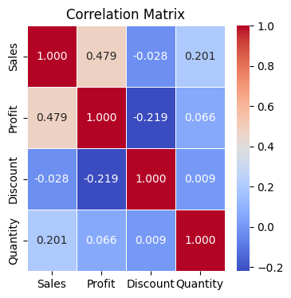
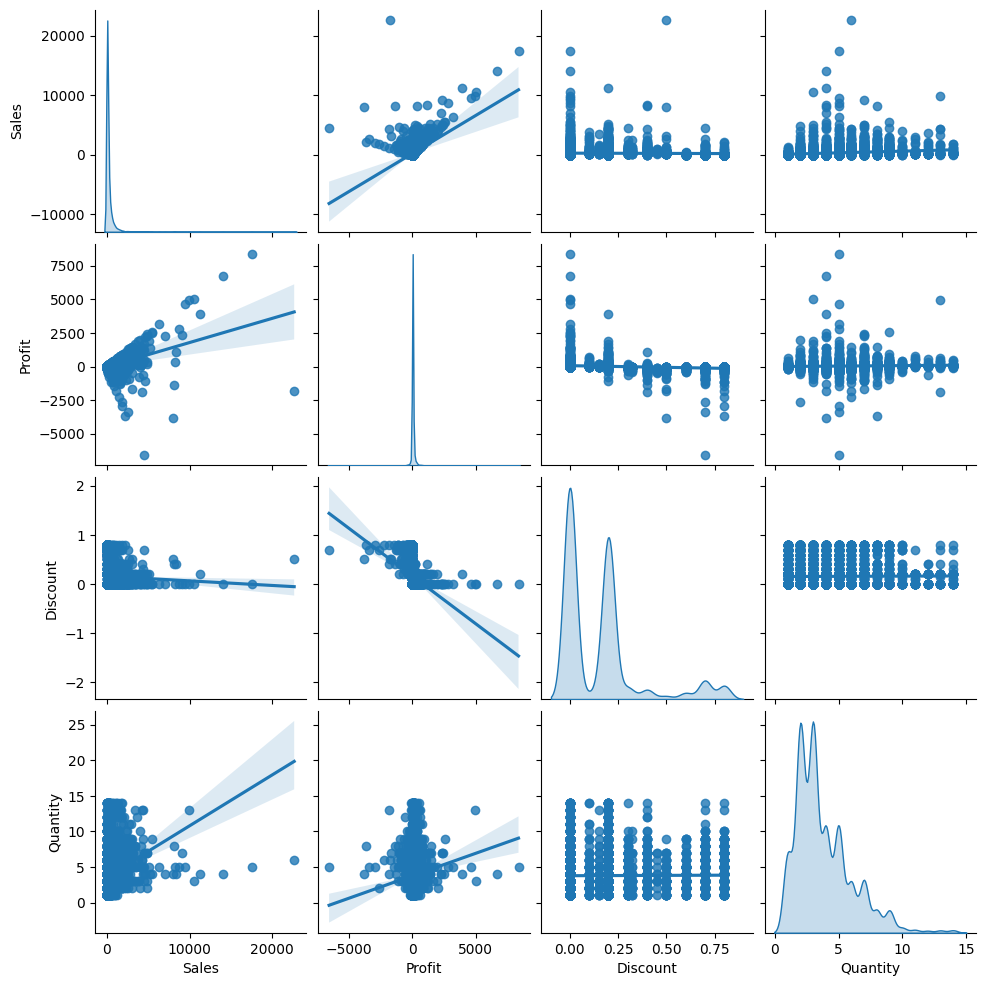
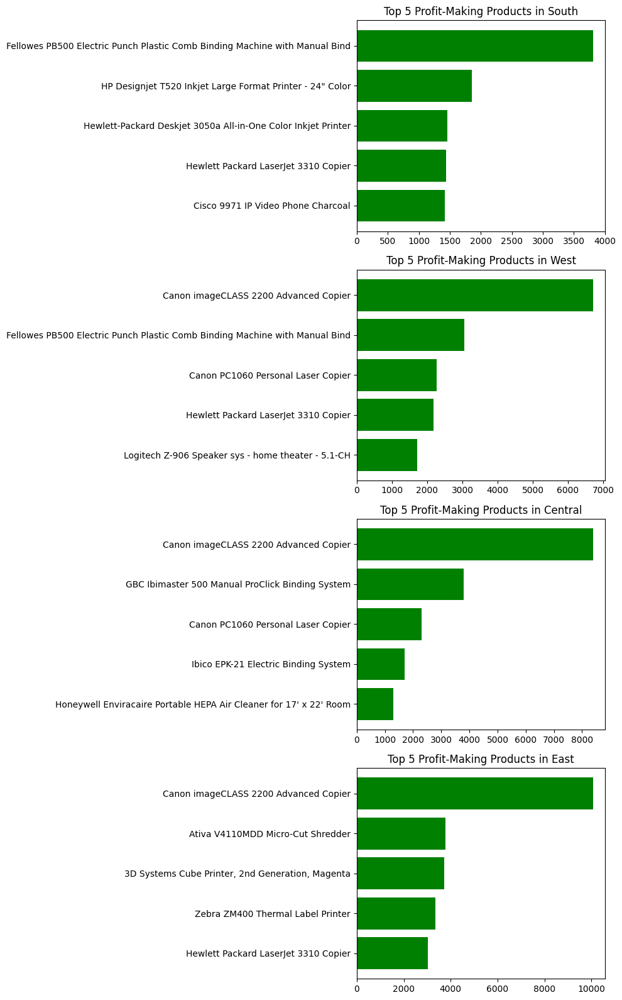
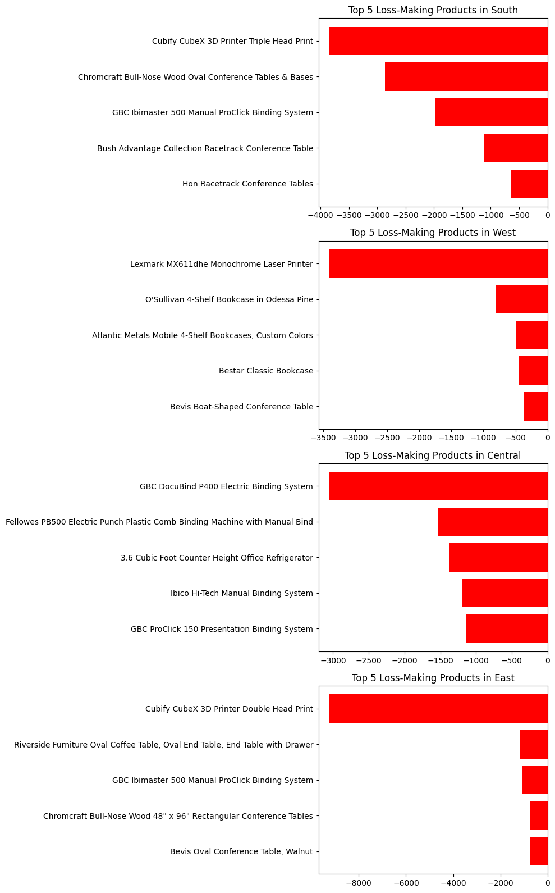
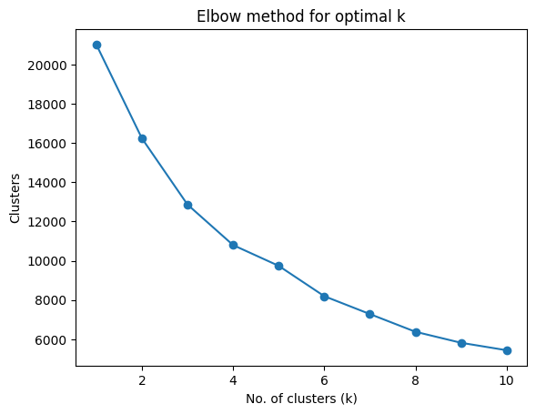
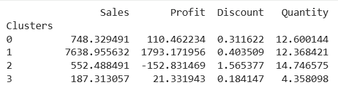
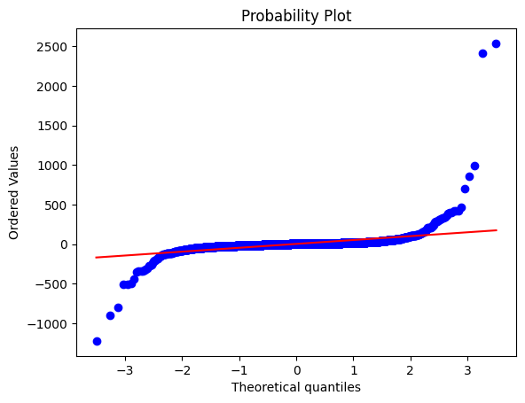

# Superstore-Analysis
This project analyzes a US retail store dataset to study product performance across regions and understand factors behind both profits and losses.


## 🛠 Tools and Techniques used
- Python (NumPy, Pandas, Matplotlib, Seaborn, Scikit-learn)
- Google Colab
- Exploratory Data Analysis (EDA)
- Feature Engineering
- Clustering (K-Means)
- Regression Models


## 📂 Dataset Overview
- Sample Superstore dataset  
- ~9,900 records  
- Features include sales, profit, discount, quantity, category, sub-category, and region.


## 📊 Exploratory Data Analysis
### **Correlation Heatmap**
Helps understand the relationship between numerical features like sales, profits, discount, and quantity.



### **Pairplot**
Shows the distribution, outliers, and relationship between sales, profits, discount, and quantity.



### **Top 5 profit-making products**
Highlights products contributing the most profit in each region in the US.



### **Top 5 loss-making products**
Identifies the five least profit-making products in each region in the US.



## 📌 Cluster Analysis

### Elbow method
Used to determine the optimal number of clusters for K-Means.


### Cluster Summary
Average performance metrics across different clusters.



## 🤖 Machine Learning Models

### Linear Regression
- R² Score: **0.84**
- MAE: 26.41
- RMSE: 91.27

### Random Forest Regression
- R² Score: 0.76
- MAE: 9.71
- RMSE: 112.93

### Decision Tree Regression
- R² Score: 0.58
- MAE: 12.51
- RMSE: 149.03

👉 ***Linear Regression Model performed better among the other models.***



## 🔍 Insights
- Canon imageCLASS 2200 Advanced Copier was the most profitable product across regions.
- Cubify CubeX 3D Printers (Double Head in the East and Triple Head in the South) emerged as the largest loss-making products, primarily due to heavy discounting.
- Technology category contained both the best and worst performing products.
- Feature engineering improved model performance and accuracy.
- Clustering helped identify discount-heavy, underperforming product groups.


## 📍Conclusion:
This project highlights how product category, regional performance, and discounting impact retail profitability. While the technology category produced the most profitable product, it also accounted for the largest losses due to high discounts.

Overall, I improved my skills in exploratory data analysis, feature engineering, clustering, and regression modeling, with a strong focus on turning data into business insights. 


## 📁 Project Structure

```
Superstore-Analysis/
│
├── Superstore_Analysis.ipynb
├── Superstore_Report.pdf
├── Sample - Superstore.csv
├── README.md
├── LICENSE
└── images/
    ├── correlation_heatmap.png
    ├── pairplot.png
    ├── top5_profit_products.png
    ├── top5_loss_products.png
    ├── elbow_method.png
    ├── cluster_summary_table.png
    ├── residual_plot.png
```
---

